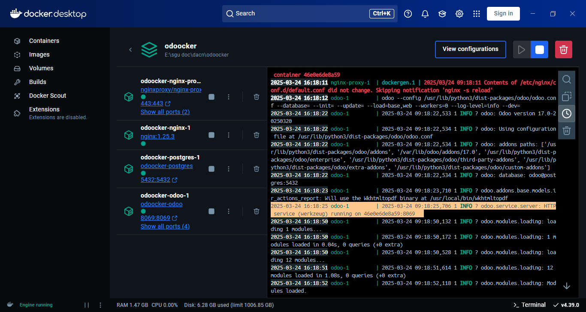
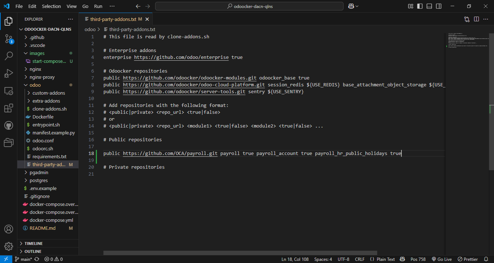
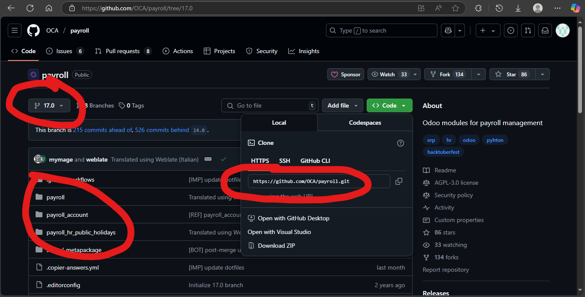
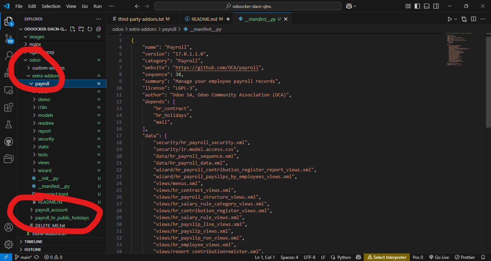
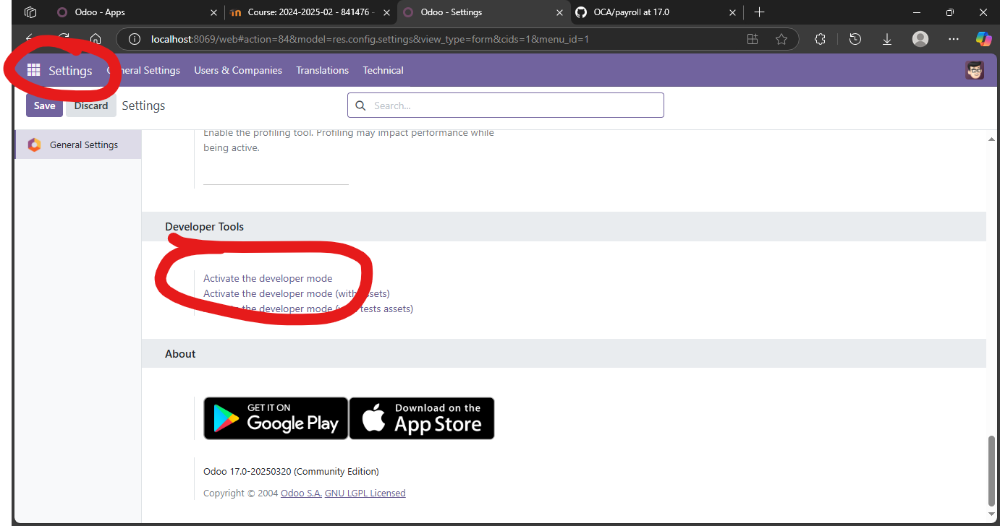
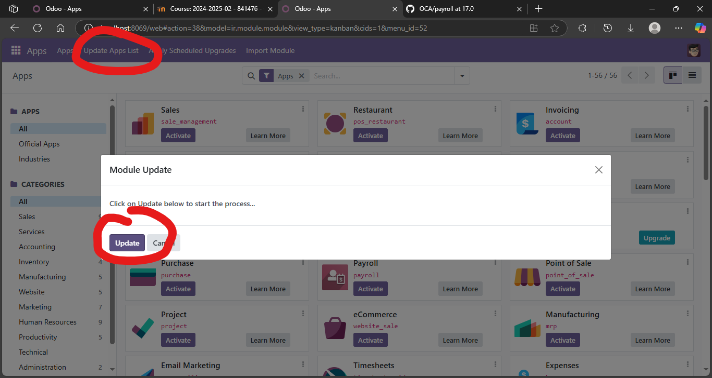
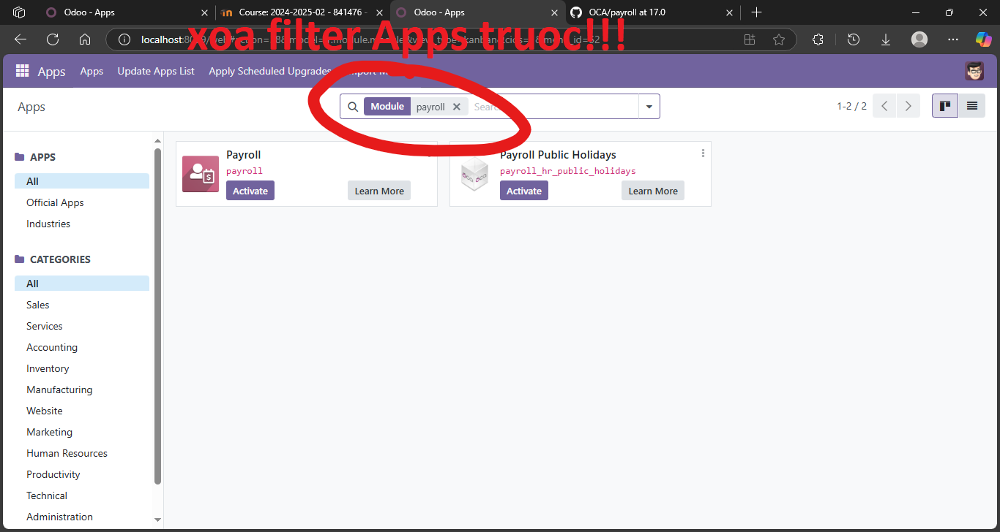

# Luu y: fork lam do an chuyen nganh odoo 17.0 quan ly nhan su

### note module ngoai da cai san

-   `payroll` https://github.com/OCA/payroll

## cai odoo docker

1. Fork branch **17.0**, **autocrlf false** (neu xai windows):

```bash
git -c core.autocrlf=false clone -v -b 17.0 https://github.com/bhbghghbgb/odoocker-dacn-qlns.git
cd odoocker-dacn-qlns
```

2. chay compose

```bash
docker-compose -f docker-compose.yml -f docker-compose.override.yml up -d
```

3. neu chay thanh cong, se co hang log:

```
2025-03-24 16:18:25 odoo-1         | 2025-03-24 09:18:25,706 1 INFO ? odoo.service.server: HTTP service (werkzeug) running on 46e0e6de8a59:8069
```



4. tim container `odoocker-odoo-1`, nhan vao `8069:8069` de mo len, hoac vo http://localhost:8069/

5. master password la

```
odoo
```

## cai addon/module/plugin

### neu co link github

1. vao `odoo/third-party-addons.txt` ghi link va module can cai vao
   
2. vi du cai module payroll tu https://github.com/OCA/payroll: (nho chon dung version xem co module gi)
   

3. vi du cai het 3 module `payroll` `payroll_account` `payroll_hr_public_holidays`:

```
# Public repositories

public https://github.com/OCA/payroll.git payroll true payroll_account true payroll_hr_public_holidays true
```

4. chay compose --build

```bash
docker-compose -f docker-compose.yml -f docker-compose.override.yml up --build -d
```

### ko link github (neu ko co link github moi lam cach nay)

1. tai thu muc module ve bo vao `odoo/extra-addons`, vi du cai het 3 module `payroll` `payroll_account` `payroll_hr_public_holidays` tu https://github.com/OCA/payroll



2. chay compose --build

```bash
docker-compose -f docker-compose.yml -f docker-compose.override.yml up --build -d
```

### update odoo de hien module

1. vo App `Settings` > `Activate the developer mode`
   

2. update apps list
   

3. search module (**xoa filter Apps**)
   

# Odoocker: The Ultimate Odoo Docker Framework

Welcome to Odoocker, a game-changer in the world of Odoo Development and Deployment. This tool is meticulously crafted to revolutionize your experience with Odoo, ensuring simplicity, efficiency, and a top-tier development journey. And while it’s rooted in the principles of the Official Odoo Docker setup, it goes several steps beyond.

Whether you're using the **Community** or **Enterprise** edition, this **Docker** solution is tailored just for you.

**Best part of this?** You don't need any prior knowledge of **Docker**, **Odoo** or any technology that involves this Framework. We stick to Docker philosophy: **Use it, then learn about it.**

Feel free to post a Pull Request to continue enhancing this project.

### Why Odoocker Stands Out:

1. 🌐 **Universal:** Suitable for both Odoo Community and Enterprise editions.
2. 📦 **Easy Setup:** Clone, configure `.env` file, and you're ready to deploy.
3. 🔒 **Secure:** Automatic SSL certificate renewal to keep your data safe (for production only).

In essence, Odoocker isn't just another tool, it's a philosophy. So, whether you’re a seasoned Odoo veteran or just starting your journey, Odoocker is here to make your journey easier.

## Contents

-   [Quick Setup Guide](#quick-setup-guide)
-   [The `.env` File](#the-env-file)
    -   [Environment-based actions](#environment-based-actions)
        -   [1. Fresh or Restore](#1-fresh-or-restore)
        -   [2. Local](#2-local)
        -   [3. Debug](#3-debug)
        -   [4. Testing](#4-testing)
        -   [5. Full](#5-full)
        -   [6. Staging](#6-staging)
        -   [7. Production](#7-production)
-   [Pro(d) Tips](#prod-tips)
    -   [1. Search through all Addons at once](#1-search-through-all-addons-at-once)
    -   [2. Define the following aliases](#2-define-the-following-aliases)
    -   [3. NEVER run **docker-compose down -v** in Production](#3-never-run-docker-compose-down--v-in-production)
    -   [4. Odoo Shell](#4-odoo-shell)
    -   [5. Odoo Scaffold](#5-odoo-scaffold)
    -   [6. Colorize your branches](#6-colorize-your-branches)
-   [DB Connection](#db-connection)
    -   [PgAdmin](#pgadmin-container)
-   [Deployment Process](#deployment-process)

# Quick Setup Guide:

1. **Clone and Configure**:

```
git clone git@github.com:odoocker/odoocker.git
cd odoocker
cp .env.example .env && cp docker-compose.override.local.yml docker-compose.override.yml
```

2. **Hosts & Domains**: To ensure everything runs smoothly, remember to add the necessary domains to your hosts file.

For _Unix_:

```
echo '127.0.0.1 erp.odoocker.test' | sudo tee -a /etc/hosts
echo '127.0.0.1 pgadmin.odoocker.test' | sudo tee -a /etc/hosts
```

For _Windows_, manually add these lines to C:\Windows\System32\drivers\etc\hosts:

```
127.0.0.1 erp.odoocker.test
127.0.0.1 pgadmin.odoocker.test
```

# The `.env` File

The environment variables located in [`.env`](https://github.com/odoocker/odoocker/blob/main/.env.example) provide dynamic configurations to Odoo and the project in general.
The [`odoo.conf`](https://github.com/odoocker/odoocker/blob/main/odoo/odoo.example.conf) file is generated by the [`odoorc.sh`](https://github.com/odoocker/odoocker/blob/main/odoo/odoorc.sh) script based on the environment variables.
<br>
This file is divided in sections, you most likely are going to focus on the `Main Configuration` section. This provides quick access to project and `odoo.conf` variables. The rest of section are container specific variables for different container. (Note: you may find _repeated variables_ like `SUPPORT_EMAIL=${SUPPORT_EMAIL}` which interacts with different containers. This is to explicitly denote in the `.env` file that this variable is being shared through those containers.

Sample `.env` file:

```
# Odoo
APP_ENV=debug
INIT=
UPDATE=my_custom_addon
LOAD=base,web
WORKERS=2
DEV_MODE=reload,qweb
DOMAIN=erp.odoocker.test

# Enterprise (GitHub User with access to Odoo Enterprise [https://github.com/odoo/enterprise] Repo)
# If not present, Odoo Community will be brought up.
GITHUB_USER=odoocker
GITHUB_ACCESS_TOKEN=ghp_token

# Database
ADMIN_PASSWD=odoo
DB_HOST=postgres (container or external host)
DB_PORT=5432
DB_NAME=my-odoo-db
DB_USER=odoo
DB_PASSWORD=odoo
LOAD_LANGUAGE=es_MX
...
```

<br>

## Environment-based actions:

[`odoo/entrypoint.sh`](https://github.com/odoocker/odoocker/blob/main/odoo/entrypoint.sh) file is the gateway for our Odoo container. Depending on the `APP_ENV` and the rest of the environment variables, it determines how to start the Odoo service (like local, testing, production, etc.) with different configurations.
<br>
In all environments, `odoo.conf` follows the `.env` file variables. Some environments may have command-line parameter to overwrite certain configurations.

**To bring up all the environments run**:

```
docker-compose up -d --build && docker-compose logs odoo
```

Restart adding `down`:

```
docker-compose down && docker-compose up -d --build && docker-compose logs odoo
```

### 1. Fresh or Restore

These environments (`APP_ENV=fresh` or `APP_ENV=restore`) will have no database created. Are perfect for setting up a **fresh database** instance or **restoring a production database**.

### 2. Local:

This environment (`APP_ENV=local`) will strictly follow the `.env` variables with no command-line overwrites. You'll most likely be using this regularly.
Use `DEV_MODE=reload,qweb` to activate hot reload when changing `python` and `xml` files.
<br>
If you prefer to update the packages everytime you restart Odoo container, you can set `UPDATE=module1,module2,module3`.

### 3. Debug:

This environment (`APP_ENV=debug`) works same way as local, but it starts Odoo using the `debugpy` library. Thanks to our [`.vscode/launch.json`](https://github.com/odoocker/odoocker/blob/main/.vscode/launch.json), if you are using **Visual Studio Code**, you can start a Debugger session so the container is aware of your breakpoints and stop wherever you need. This is **my favorite** environment to work since I use the debugger a lot while developing.

### 4. Testing:

This environment (`APP_ENV=testing`) is specific for running tests _(and will be included in a CI/CD pipeline in a future version)_. It help us test the modules we are developing to ensure a safe deployment.
<br>
A `test_DB_NAME` database is automagically created.
The `ADDONS_TO_TEST=addon_1` are installed in that fresh DB.
Use `TEST_TAGS=test_tag_1` to filter your tests.

**NOTE: Avoid running tests without tags**; otherwise, it will trigger tests in all installed addons and we don't want this. For now, let's assume Odoo Community & Enterprise tests passed and only focus on the things you need to test.

### 5. Full:

This environment (`APP_ENV=full`) will install the `INIT` modules in a new or existing `DB_NAME`. It allows us to have a fresh production database replica.

### 6. Staging:

This environment (`APP_ENV=staging`) sets `UPDATE=all`; it allows us to **update all installed addons at once**.
<br>
It also allows to install new packages before the upgrade through `INIT`.
<br>
It's highly recommended to use this command to run this environment

```
docker-compose down && docker-compose pull && docker-compose build --no-cache && docker-compose up -d && docker-compose logs -f odoo
```

This will `pull` the latest _Odoo Community, Enterprise, Extra and Custom addons_, basically, it **upgrades the whole Odoo instance** to the newest. Additionally, it will also pull the latest images of the other containers in this project. This environment is perfect for deployments.

**NOTE: Do not bring down & up again, unless you want to perform a whole upgrade again.**

### 7. Production:

This environment (`APP_ENV=production`) ensures no demo data is loaded, debugging and dev_mode are turned off. It also brings up the `Let's Encrypt` container, so you won't worry about `SSL Certificates` anymore! Some `.env` variables are overwritten in this setup.

-   Take down previous setup of containers

```
docker-compose down
```

-   Replace the `docker-compose.override.yml` with `docker-compose.override.production.yml` to bring `Let's Encrypt` container.

```
cp docker-compose.override.production.yml docker-compose.override.yml
```

-   Update .env `SERVICES` (add `acme`) and `ACME_CA_URI` (use production link).
-   Make sure the DNS record of your `DOMAIN` is pointing to your server.
-   Rebuild the containers

```
docker-compose up -d --build && docker-compose logs odoo
```

# Pro(d) Tips

The following tips will enhance your developing and production experience.

## 1. Search through all Addons at once:

If you are using `Visual Studio Code` & the **Docker Extension** is installed, you can open the Odoo Container in the `ROOT_PATH`. There you will find all Odoo `Community Addons`, `Enterprise Addons`, `Extra Addons` and `Custom Addons` in the same folder level.
<br>
Using the Search Panel will allow you to look at every single reference of what you are looking for in the whole Odoo Instance and not just in your addons.

## 2. Define the following aliases:

```
alias odoo='cd odoocker'

alias hard-deploy='docker-compose down && git pull && docker-compose pull && docker-compose build --no-cache && docker-compose up -d && docker-compose logs -f odoo'

alias deploy='docker-compose down && git pull && docker-compose up -d --build && docker-compose logs -f --tail 2000 odoo'

alias logs='docker-compose logs -f --tail 2000 odoo'
```

## 3. NEVER run `docker-compose down -v` in Production

...without having a `tested backed up` database
<br>
Have in mind that dropping volumes will destroy DB data, Odoo Conf & Filestore, _Let's Encrypt certificates, and more!_ If you execute this command several times in `prod` in a short period of time, you may reach the `Let's Encrypt certificates limit`` and Odoocker won't be able to generate new ones after **several hours**.

## 4. Odoo Shell

1. Log into the odoo container

```
docker-compose exec odoo bash
```

2. Start Odoo shell running:

```
odoo shell --http-port=8071
```

## 5. Odoo Scaffold

1. Log into the odoo container

```
docker-compose exec -u root odoo
```

2. Navigate to custom addons folder inside the container

```
cd /usr/lib/python3/dist-packages/odoo/custom-addons
```

3. Create new addons running:

```
odoo scaffold <addon_name>
```

-   The new addon will be available in the `odoo/custom_addons` folder in this project.

## 6. Colorize your branches

Add the following to `~/.bashrc`

```
# Color git branches
function parse_git_branch () {
  git branch 2> /dev/null | sed -e '/^[^*]/d' -e 's/* \(.*\)/(\1)/'
}

if [ "$color_prompt" = yes ]; then
    #PS1='${debian_chroot:+($debian_chroot)}\[\033[01;32m\]\u@\h\[\033[00m\]:\[\033[01;34m\]\w\[\033[00m\]\$ '
    # Color git branches
    PS1="${debian_chroot:+($debian_chroot)}\[\033[01;32m\]\u@\h\[\033[00m\]:\[\033[01;34m\]\w \[\033[01;31m\]\$(parse_git_branch)\[\033[00m\]\$ "
else
    PS1='${debian_chroot:+($debian_chroot)}\u@\h:\w\$ '
fi
unset color_prompt force_color_prompt
```

# DB Connection

-   Any other Postgres Database Manager can connect to the DB using the `.env` credentials.

## PgAdmin

-   This project comes with a PgAdmin container which is loaded only in `docker-compose.override.pgadmin.yml`.
    In order to manage DB we provide a pgAdmin container.
    In order to bring this up, simply run:

```
docker-compose -f docker-compose.yml -f docker-compose.override.yml -f docker-compose.pgadmin.yml up -d --build
```

And to turn down

```
docker-compose -f docker-compose.yml -f docker-compose.override.yml -f docker-compose.pgadmin.yml down
```

If your instance has pgAdmin, make sure you adapt your aliases to this configuration.

# Deployment Process

Note: the deployment process is easier & faster with aliases.

1. Backup the production Databases from `/web/database/manager`.
2. Run

```
sudo apt update && sudo apt upgrade -y
```

-   If packages are kept, install them

```
sudo apt install <kept packages>
```

3. Restart the server

```
sudo reboot
```

-   Make sure there are no more upgrades or possible kept packages

```
sudo apt update && sudo apt upgrade -y
```

4. Go to the project folder in /home/ubuntu or (~)

```
cd ~/odoocker
```

or with alias:

```
odoo
```

5. Pull the latest `main` branch changes.

```
git pull origin main
```

6. Set [`Staging`](#6-staging) environment
7. Set [`Production`](#7-production) environment

# Footnote

This project is based on the [Official Odoo Docker](https://hub.docker.com/_/odoo/) image. We've strived to ensure a seamless integration with the original Docker setup while making necessary customizations to suit our requirements. We encourage contributors and users to frequently refer to the official documentation for foundational concepts and updates. Thank you for your continued support and trust in our project.
